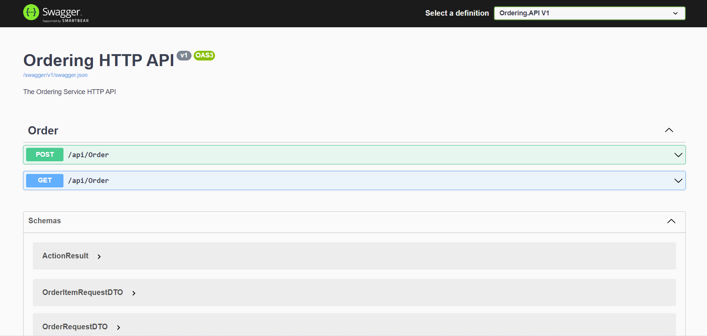
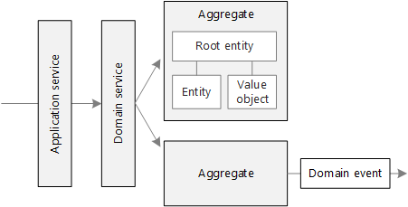

# Ordering API


Ordering API is .NET Core API that handles accepting new orders. It is an assignment for albelli recruitment

### Architecture

Ordering API is built with following Domain Driven Design. We try to keep the complicated business logic in domain models (Aggregate, Entities, Value Object) and publish domain events for integration among other bounded context.


## Installation
- Checkout main branch
- Open the `Ordering.sln` solution .
- Set data provider in `appsettings.json` file and modify the default connection string accordingly
	```javascript
	"ConnectionStrings": {
		"Default": "Server=#{DB_SERVER_NAME}\\SQLEXPRESS;Database=Ordering;Trusted_Connection=True;ConnectRetryCount=0"
	}	
	```
- Build
- Run migrations

## Migrations
- Open package manager console
- Select default project `Ordering.Infrastructure` from the  dropdown
- run 'Update-Database'

## Usage
Run using IIS or IISExpress (hit ctrl + F5). It will open swagger interface where endpoint can be seen.